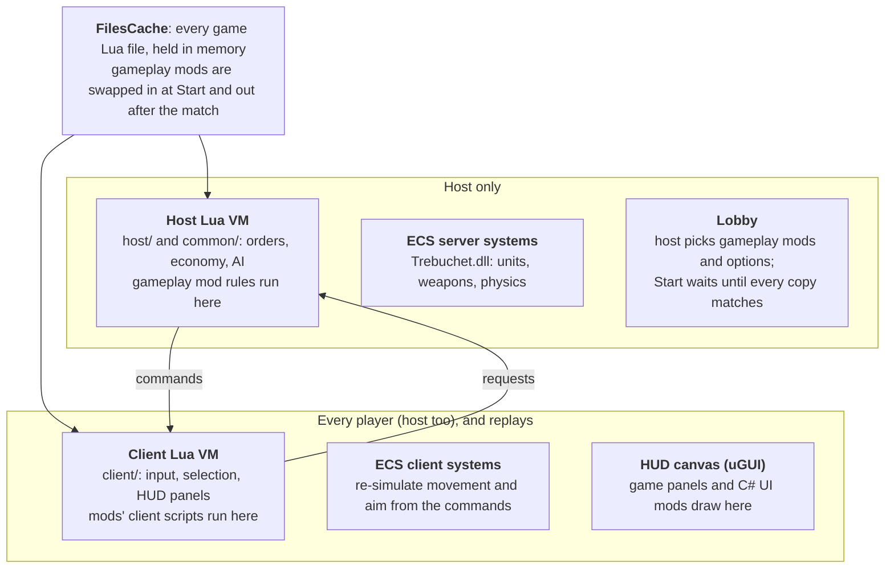

# Modding Sanctuary: Shattered Sun — Field Notes

Checked against the playtest, game 0.0.1.20, on 2026-10-02.

## Start here

If you want to mod Sanctuary: Shattered Sun, build on the Mod Manager and its Mod API rather than starting from bare BepInEx. You get hot-loading, a lobby that syncs gameplay mods between players, mod options and a Lua bridge for free. These notes are what we learnt building about a dozen mods for the Playtest (Steam app 4511930), written so you don't have to learn it the hard way.

- **Install (players and modders):** the [Mod Manager release](https://github.com/Remmyboy/sanctuary-mods/releases?q=ModManager). It ships BepInEx config, the loader and the Mod API in one zip.
- **Step-by-step tutorial:** [your-first-mod.md](your-first-mod.md)
- **Full reference:** [writing-mods.md](writing-mods.md) and the manifest schema [mod.schema.json](mod.schema.json)
- **Copy-and-go starting points:** [templates/sanctuary-mod](../templates/sanctuary-mod) and [examples/](../examples) (a UI mod, a gameplay mod, a Lua faction, a supply-drop game mode)

Everything below is from a Playtest build, and the game patches often. Where something is a game rule or number, we checked it in the game's code or in a match; re-check before you rely on it after a patch.

## Getting set up

Install the Mod Manager Standalone zip into the game's `engine` folder, then put each mod in its own folder under `engine\SanctuaryMods\`. The loader in `BepInEx\plugins` watches that folder and hot-loads whatever lands there, so you rarely restart the game.

**Where things are**

| What | Path |
| --- | --- |
| Game | `Steam\steamapps\common\Sanctuary Shattered Sun Playtest\engine` |
| Game DLLs to compile against | `engine\Sanctuary_Data\Managed` (Trebuchet.dll is the game's code) |
| Game Lua | `engine\LJ\lua` |
| Mods | `engine\SanctuaryMods\<YourMod>\` |
| Plugin log (overwritten each launch) | `engine\BepInEx\LogOutput.log` |
| Unity log (exceptions from mod code land only here) | `%USERPROFILE%\AppData\LocalLow\Enhearten Media PTY\Sanctuary\Player.log`, plus `Player-prev.log` |
| Replays | `...\LocalLow\Enhearten Media PTY\Sanctuary\Replays` |

**If you use plain BepInEx instead of our zip:** set `HideManagerGameObject = true` under `[Chainloader]` in `BepInEx\config\BepInEx.cfg`. The game destroys foreign root GameObjects after start-up, so with the default `false` every plugin runs `Awake` and then silently never `Update`s. The tell is a log that stops at "Chainloader startup complete". Ship that cfg in any zip you hand to players.

**Building a C# mod**

- Target `net472` and reference the game's DLLs and `Sanctuary.ModApi.dll` with `Private=false`, so nothing is copied beside yours. The [template](../templates/sanctuary-mod) does this: `dotnet new sanctuary-mod -n MyMod --kind ui|gameplay`.
- `dotnet build` deploys straight into the game and the loader reloads it within a second, even mid-match. When you're playing a match you care about, build with `-p:DeployPath=<some other folder>`.
- **One DLL per mod, and no DLL referencing another.** The loader loads each DLL under a fresh identity so it can reload it, which breaks cross-assembly references. Share code as source files compiled into each mod; that's what our `shared/` folder is.
- Mono can't unload an assembly. Undo everything in `OnDestroy` (Harmony patches, GameObjects, static event handlers, injected Lua), use a fresh Harmony id per load, and keep state in fields rather than statics.
- Don't ship Harmony, Newtonsoft.Json or BepInEx; the game already has them.

**BepInEx config quirks:** changing a `Config.Bind` default never overwrites a value already in the player's cfg, so renaming a setting is the only way to reset it. Edits to the cfg file while the game runs are ignored.

**Preloader patchers are different.** A patcher that rewrites Trebuchet.dll at load (the SCOM overhaul is one) goes in `BepInEx\patchers`, needs a restart, and must load from a file. Dropping one into `SanctuaryMods` does nothing useful. It is also pinned to one game build, so every game patch breaks it until its author rebuilds.

## How the game is put together

Sanctuary is a Unity game whose engine is `Trebuchet.dll` (C#, Unity ECS) and whose gameplay is LuaJIT. Only the host runs the match; every other player, and every replay, rebuilds it from the host's command stream.

Gameplay mods change the host's Lua, so every player needs them; UI mods live on one player's client and need nobody else.

- **The tick is 0.1 s** (10 a second, 6 subticks at 60 Hz). Mod timers in game time follow pause and game speed.
- **Commands are state, not input:** create this unit, set its health, move it towards here. Clients re-simulate movement, aim, projectiles and animation from them. There are no state snapshots, so no late join or reconnect.
- **Every player must run identical Lua.** Our lobby hashes every overlaid file before Start, so a mismatch is caught there rather than mid-match.
- **Enforce rules on the host, not just in menus.** Hotkey mods and scripts send their own requests, so a rule that only hides a menu button doesn't hold.
- **Orders can only be added or cleared.** There is no order edit and no queue reorder on the host; the factory queue only takes "+/- N of this item". Our waypoint and queue editing clear and re-issue.
- **Native replays** (`.sanreplay`, since the 2026-09-04 patch) are a recording of the match, played back through a stand-in socket. Anything you draw from client Lua therefore works in replays too.
- **Burst:** about two thirds of `ClientLuaInterface`'s methods (245 of 364 when we counted) are Burst-compiled, and a Harmony patch on one of those silently does nothing. Check that `GeneratedDelegates`' static constructor binds it as a managed delegate before you patch it.
- **The lobby has no spare fields.** `LobbyPlayer.Serialize` is a fixed run (type, id, name, army, team, faction, ready). Our Mod API sends its own lobby message types instead, which vanilla clients ignore, so modded and vanilla players still see each other's lobbies.
- **There's no observer slot:** a human whose army id is beyond the map's army count observes. Everyone defaults to team 1.
- **No score exists** anywhere in the game's Lua or C#. Our match stats compute a FAF-style score from their own hooks.
- **Steam app ids:** full game 1699050, demo 2375120, playtest 4511930. `Application.version` can be read offline from `Sanctuary_Data/globalgamemanagers`.

## Lua modding

The single most useful fact: **game Lua files are modules, not globals.** Most "my hook is installed but does nothing" bugs come from that, and they fail silently. The game's Lua is in `engine\LJ\lua` (`host\`, `client\`, `common\`, `AI\`); read it there.

**Scoping and hooking**

- `Import()` gives every file its own environment, and that table *is* the module it returns (`__index = _G` only for reads). A function declared at the top of `client/inputEventsFunctions.lua` lives in that file's table, not in `_G`.
- A chunk you inject from C# runs in `_G`, so it sees `nil` for those names. Go through the module: `Import('client/inputEventsFunctions.lua').GetHoverUnit()`.
- To hook, assign on the module table: `m.IssueAssistOrder = wrapper`. The file's own internal calls resolve against the same table, so they pick up your version too.
- Genuine `_G` globals: `Armies`, `__Entities`, `Tags`, `buildQueueUtils`, `Import`, `Log`, `Warn`, `Error`, and `ReceiveDataClient`.
- `classy.lua` propagates a method set on a base class to every subclass that doesn't override it. Hooking `HostUnit.X` reaches every unit type.
- Many files end in a top-level `return {...}`, so a naive append after it never runs (this breaks the game's own unused `append/` feature). The Mod API inserts appends before that return.
- Client and host commands live in `common/commands/registry.lua`, with each command in `common/commands/definitions/*.lua`. Each is a table whose `.Receive(data, commandData)` you can replace (use `rawset`; the registry guards new keys).

**Logging and silent failures**

- `Log()` is debug level and filtered out of Player.log. Use `Warn()` for anything you need to see.
- "No errors" proves nothing. A missing function inside a `pcall`, a nil-guarded early return, or a missing AI build-condition function (which resolves to false) all fail without a word. Have your code set a counter global and check it.
- From C#, reading a Lua global with `lua_tostring` only converts numbers and strings: a global set to `true` reads back exactly like a missing one. Probe with a number or string.
- Running Lua from C# before the match has loaded does nothing. Wrap injected chunks in `pcall` and store the error in a string global, or you'll never see it.
- `Engine.*` functions are listed in `LJ/lua/client/generated/doc/engineFunctions.lua`. Diff your calls against it after every patch.

**Other gotchas**

- Each VM runs your code once: the host's and every client's. Side effects such as logging and counters happen once per VM.
- Seed `math.random` on the host (for example with `os.time()`), or random picks repeat from match to match.
- Input: `inputSystem.lua` tracks Alt/Ctrl/Shift from key events only. Alt-Tab during a loading screen can leave Alt "held", and every key then arrives as `Alt-<key>`. Any "hotkey does the Alt variant" report is this first.
- Key bindings in `LoadedActionMap` are shallow copies of `InputActions`, so find an action by function identity, not by name.
- Syntax-check against the game's own LuaJIT: `Sanctuary_Data\Plugins\x86_64\lua51.dll` can be P/Invoked (`luaL_loadbuffer`) with no game running. Our [tools/lua-check.ps1](../tools/lua-check.ps1) does this for files and for Lua embedded in C# strings.
- For logic tests without the game, a MoonSharp console harness works: stub `Import` over a table of modules and stub `table.shallowCopy`/`table.find` (the game's `table.lua` needs LuaJIT's `table.new`).

## UI modding

Put your UI on the game's own uGUI canvas, not IMGUI. We started with `OnGUI` and moved the whole HUD to uGUI because IMGUI clicks fall through to the map, its fonts and scaling are guesses, and one exception mid-`OnGUI` silently kills every later control.

**The in-match HUD**

- It is plain uGUI (namespace `SanctuaryUI`). Every panel is a `SanctuaryPanelUI` with public `buttonPrefab`, `itemContainer` and `canvasGroup`.
- **Scale:** `SanctuaryUIManager.AdjustUIScale` sets each canvas's `scaleFactor` to `Screen.height / 2160 × uiScale`. One canvas unit is 0.5 px at 1080p, and the game's 80-unit tile is 40 px.
- **Clone the game's art.** Instantiate `panel.buttonPrefab` under an inactive holder, read the element's fields, `DestroyImmediate` the game's `UnitButtonElement` (and any `TooltipTrigger`), add your own component, then reparent and activate. Cloned TMP text brings the game's Rajdhani font for free.
- **Forward real clicks.** To drive a concealed game button, pass the real `PointerEventData` to it with `ExecuteEvents.Execute` (down, up, enter, exit). Shift- and right-clicks then behave exactly as in vanilla. Game buttons act on pointer *up*, and only while `isHoldingClick` (a pointer exit resets it).
- `ExecuteEvents` skips inactive components, so a button hidden with `SetActive(false)` can't be clicked. To hide a game panel but keep it working, hold its `CanvasGroup` at alpha 0 with `blocksRaycasts = false`, and postfix `SanctuaryPanelUI.SetPanelVisibility` to keep it there. Lua keeps filling it and its buttons stay live.
- **Buttons are pooled.** `Clear()` scales them to zero and hands them back out later. `UnitButtonElement.SetText` skips empty or "?" text, so the label you read may be left over from the button's last use. Read it only with `textOverlayContainer.activeSelf`, and spot placeholders with `emitClickEvents`.
- A panel's root `RectTransform` isn't always where it draws. The construction panel's visible strip is its child `Panel Dashed`; anchor to the child.
- Order button sprites have an empty `sprite.name` and a negative `textureRect.height`. Don't treat height ≤ 0 as "nothing to draw". Identify buttons by sibling order instead, which matches the `elements` table in `client/ui/ordersPanel.lua`.
- Only 6 of the 21 order buttons have click functions in Lua; the rest do nothing on click.
- Pooled uGUI objects die with the match scene. Clear or null-prune static pools when you rebuild.
- Tooltips: put a `TooltipTrigger` (title, description) on any object; a singleton `TooltipPanelUI` shows it.
- uGUI blocks clicks over your panel, but not scroll-wheel zoom or edge-pan. The game gates only clicks, through `Engine.IsMouseOverUI()`.

**The front menu**

- It is uGUI on the Michsky "Beam UI" kit (TextMeshPro, accent `#3DAFFF`). Since 0.0.1.20 the screens are registered in `InterfaceManager`'s `PanelManager` by window name, and the side bar is its own canvas.
- To add a page, clone the Settings screen's `panelObject`, register it as a new `PanelItem` whose `panelButton` is your cloned side-bar button, and open it with `OpenPanel(name)`. Strip `LocalizedObject` components from anything you retext, or localisation puts the old words back.
- Clone into an inactive holder before reparenting, so `Awake` runs after your edits. Our [ModManager Mods page](../ModManager) is a worked example.
- `SanctuaryUIManager.Instance` outlives a match. Tell menu from match by the window you came from.

**No DLL at all?** A gameplay mod can draw draggable, resizable HUD panels from Lua with the Mod API's `modapi/ui.lua`. See "Building on the Mod API" below.

## Building on the Mod API

Most gameplay mods need no C# at all: a folder with a `mod.json` and a `lua\` tree that mirrors the game's. The Mod API handles the lobby sync, options, match events, HUD panels, factions, AI seats and art packs. The [full reference](writing-mods.md) has every field and call; this is the map.

| | UI mod | Gameplay mod |
| --- | --- | --- |
| Changes | Your own screen: HUD, hotkeys, camera | The match: units, rules, factions, AI, art |
| Made of | A C# DLL | Lua and `.santp` files, `.sanpack` art packs, optionally a DLL |
| Switched on by | Each player, on the Mods page, any time | The lobby host, before Start |
| Others need it | No | Yes, byte-identical, or Start stays greyed out |
| Hot reload | Within a second, even mid-match | Lua: next match. DLL: after the match |

**How a gameplay mod gets into a match**

1. The host picks it in the lobby's Mods panel. Nothing is on by default, and ladder lobbies can't have any.
2. Every player with the framework hashes their copy (every overlaid file, art pack, option definition and gameplay DLL) and reports back. Start waits until every hash matches, and the panel names who has what.
3. At Start the files are swapped into the game's in-memory file cache. Nothing on disk changes.
4. The pick is frozen for the match. Afterwards the cache goes back to vanilla.
5. Replays record the mods and option values in a `.mods.json` beside the replay and put them back on to play.

**Ways in, in order of preference**

- **Append** (`lua\append\<path>`): your code runs at the end of the game's file, in the same chunk, with its locals in scope. It survives game updates, and several mods can append to one file. Use this.
- **Host and client scripts** named in `mod.json`, plus `modapi/events.lua`: `OnMatchStart`, `After`, `Every`, `OnTick`, `OnArmyDefeated`, and kill and damage hooks. The game itself doesn't record who killed a unit; the API works it out.
- **Options** in `mod.json` (toggle, choice, number). The host sets them and every machine reads `Import("modoptions/<id>.lua").Options`.
- **Panels and toasts** from Lua with `modapi/ui.lua`. Buttons run on the clicking player's client, so send a request to the host with `SendToHost` to change the match.
- **Add** a new file under a folder named after you, so it can't collide.
- **Replace** a game file whole only as a last resort. It breaks on every patch, and two mods replacing the same file can't both win.

**Factions:** declare them in `mod.json` and the framework adds the lobby entries. Game visuals such as shields, build beams and adjacency pick materials by the three stock faction tags, which is what `looksLike` is for. Sounds can't come from art packs; new units use the game's sounds.

**AI:** AI runs on the host only. Every decision reads `Armies[i].ai.settings.modDirectory`, and the only per-AI boundary is `AI\mods\<name>\`. The loose `AI\*.lua` files are a shared engine, so an AI that edits them changes every AI in the match. The framework keeps those stock, adds the few shared functions newer AIs call, and lets the host pick an AI per seat. The AI writes its own log to `LJ\lua\AI\ai_logs`.

**Art packs:** a `.sanpack` is a zip with the game's layout inside (`Units/<id>/...`, `UI/Sprites/Icons/Units/<id>.sansprite`). Packs go in at match load and come out after. The host reads meshes and skeletons too, so every player needs identical packs.

**C# gameplay mods** are created only while a lobby has the mod picked and destroyed when the match ends. Use `Modding.IsHost` to tell which machine runs the simulation. `ModLua.Run` runs Lua in *your own* client only; it never reaches the host or other players.

Worked examples: [ExampleGameplayMod, SupplyDrop, EngineersAndRaiders, AscendantFaction, ExampleUiMod](../examples), plus two full game modes: [ZoneControl](../ZoneControl) and [PhantomX](../PhantomX).

One lesson from those game modes:

- If everyone can be allied, override `Army.ComputeWinCondition`. Otherwise the vanilla check declares victory too early or never.

## Game data: units, economy, orders

Unit stats are plain Lua tables in `LJ\lua\common\units\unitsTemplates\<id>\<id>.santp` (295 templates when we counted). Some fields are filled in at load by `common/systems/templateLoader.lua`, so read them from `unit.tp` at runtime rather than from the file.

**Unit ids:** `ue` = EDA, `uc` = Chosen, `ug` = Guardians, then `s`/`l`/`a`/`n` for structure, land, air, naval. Factories are `u{e,c,g}s{1,2,3}51{1,2,3}` (511 land, 512 air, 513 naval).

**Identify roles by tag, never by icon.** Each factory carries `FACTORY` plus exactly one of `LAND_FACTORY`, `AIR_FACTORY`, `NAVAL_FACTORY`; test with `Tags[TAG][unit.tpId]`. The T3 naval factory's strategic icon uses the *air* symbol, so sorting by icon files it under air.

**Economy (playtest numbers, checked in the templates and host Lua)**

| Commander | Value |
| --- | --- |
| Starting alloys / energy | 250 / 2,500 |
| Storage | 500 / 5,000 |
| Income | 5 alloys/s, 50 energy/s |
| Build power | 5 |

- T1 alloy extractor: 1 alloy/s. T1 power generator: 10 energy/s.
- Build drain per second = cost × build power ÷ build time (`host/systems/resourceEntity.lua`).
- Stalling works like Forged Alliance: every build slows by the same factor, the lowest over both resources of (stored + income) ÷ requested (`host/systems/economy.lua`).
- Adjacency stacks (`host/systems/adjacencyBuffs.lua`): each adjacent T1 power generator cuts a factory's energy cost 2.5% (T2 10%, T3 15%); each adjacent extractor cuts alloy cost 10%.
- Most units cost 10 energy per alloy; EDA and Guardian air cost 20.
- Nothing gates T2: a T1 factory upgrades straight to T2.
- In the economy totals, `*RequestedTotal` is demand and `*RequestedStalled` is actual spend. `GeneratedIncome` already includes harvesting.

**Damage and kills**

- `HostUnit:ProcessDamage` is an empty hook. Captures, upgrades and scripts remove units with `Delete`, which fires `OnDestroy`, not `Destroy`.
- The army stat "destroyed" is never incremented, and `DestroyUnit` carries no killer. If you need kill credit, use the Mod API's `OnUnitKilled`.
- `ProcessRayCollisionEvent` and `ProcessAreaDamage` are looked up at call time, so wrapping them reaches every caller.
- Death explosions hurt friendlies. The commander's is 5,000 damage in a radius of 15.
- Vision is collider overlap (`host/IntelDetector.lua`) with radius `tp.intel.visionRadius`. There's no line of sight.

**Orders and factory queues**

- Every factory has repeat build on by default. A repeated item's copy shares its queue ids, so vanilla right-click on the front tile removes the copy at the back. Code that edits a queue by id must expect duplicate ids.
- The queue's only edit is `RequestQueueAmount` (+/- N per queue item id). To reorder, remove the tail last-first and re-append. Removing the head fires `OnCancelConstruction`.
- Rally points live only on the host (`HostFactory.rallyPoint`). A client can only remember what it sent.
- Re-placing an unstarted build order on the same spot is refused until the host's next update deletes the old ghost. Wait for the ghost to vanish client-side, then re-issue. A started build re-issues as a repair, which finishes it.
- After issuing an order from code, call `RecalculatePendingMessages()` and `DebugDraw()` on the client order manager, or the marker flicks back for a frame.

## Maps

A map is a folder under `Sanctuary_Data\Maps\<name>\` holding a JSON `.sanmap`, a `heightmap.raw` and a `preview.png`. The format accepts several mistakes without complaint, and both traps below cost us whole sessions. Our SupCom/FAF map converter is at [github.com/Remmyboy/sanctuary-map-converter](https://github.com/Remmyboy/sanctuary-map-converter).

- **Heightmap resolution must be 2^n + 1** (257, 513, 1025, 2049), with width and length the matching power of two. Unity rounds any other value to the nearest valid one. Give it 385 and you get 513: your heights fill one corner and the rest sits at zero, under the water. Every parser and validator still says the file is fine.
- **The real player count** is the `armies` dictionary in the `.sanmap`, not the number of spawn markers. White Desert has 8 markers and 4 armies.
- Spawns are `ARMY_N` in converted maps and `Army_N` in the game's own; match them case-insensitively.
- **Playable area:** six stock maps have terrain twice the size of the play space, fenced by an `areas` entry named exactly `PlayableArea`. A rect named anything else, such as `Playable`, is ignored, and the map plays across the whole terrain. `preview.png` is rendered of the playable area. Frame anything map-shaped (mini-maps, overlays) on `Import('common/mapUtils.lua').GetDefaultPlayableArea()`, never on a list of map names.
- Lua's `Engine.GetFileContent` reads a start-up cache that never includes map folders. A miss returns an empty string, not `nil`.
- `LobbyManager.GetMapPicture` throws on the second replay of a session; read `preview.png` directly.

**Converting SupCom / FAF maps**

- Heights copy byte-for-byte: SupCom's uint16 × 1/128 is Sanctuary's uint16 × `height`/65535 with `height = 512`. No resampling.
- **The z axis runs the opposite way.** Flip the terrain *and* the markers together. Flipping only one leaves a map that passes every check while being mirrored or having every spawn in the sea. Check the fit by comparing imported terrain heights with the heights SupCom recorded on its own markers; under a metre means they agree.
- SupCom maps reference textures from the game's `env.scd` instead of embedding them. A converted map that embeds those textures redistributes GPG/Square Enix art, so keep it local. The converter's `-NoSourceTextures` mode repaints with Sanctuary's biomes or CC0 textures and is the one you can share.
- Decals: map-local decal blueprints load, but the game's decal shader draws them invisibly. We parked this until the developers ship a map with its own decals.

## Debugging and testing

Check both logs, every time. BepInEx's own Unity log writer often fails to start, so an exception in your plugin's `Awake` (a static-initialiser order bug, say) shows only in `Player.log`. Your mod then looks loaded and does nothing.

| Symptom | Look in |
| --- | --- |
| Mod didn't load, or loaded and does nothing | `Player.log` for exceptions; `LogOutput.log` for your "loaded" line |
| Gameplay mod Lua error | `Player.log`, tagged `HostLua` (simulation) or `ClientLua` (UI), with file and line. An appended line's number is past the end of the game's file. |
| Mod API: overlay, pick, Start refusal, syntax errors | `LogOutput.log`, lines from `Sanctuary Mod API`, and the Mods page's Problems list |
| AI behaviour | `LJ\lua\AI\ai_logs\AI log <date>.txt` |
| Crash | `%TEMP%\Enhearten Media PTY\Sanctuary\Crashes` |

`LogOutput.log` and `Player.log` are overwritten each launch (`Player-prev.log` keeps one more). Our dev-only [LogKeeper](../tools/LogKeeper) plugin archives the last 10 sessions.

**Testing without playing**

- **Replays are the best test bed** for anything client-side: they run the HUD, wrecks, builds and the economy stream exactly as a match does. A paused replay sends no economy updates, so anything gated on "in a match" may switch off while it's paused.
- **Drive the game from a probe plugin, not synthetic input.** We use a small plugin that polls a command file and runs Lua, takes screenshots, walks the UI tree, clicks by pointer events, plays replays and starts a skirmish against the AI. Ours is [tools/Probe](../tools/Probe) with `tools/probe.ps1`.
- Starting a skirmish from code: set an AI seat's team *before* its army. Each AI setter resends the cached army and team, so the other order silently resets the army to 0. `CanStartGame` rejects any army id above the lobby's max players.
- **Pure logic needs no game.** A net472 console can byte-load your built DLL (resolve references from `Sanctuary_Data\Managed` and `BepInEx\core`) and call its methods by reflection.

**Hot-reload traps**

- Old copies of every reloaded mod's types stay in the AppDomain. When you reflect over types, pick them by assembly name or you'll hit a dead copy.
- Hot-loaded plugin objects are `HideAndDontSave`. Find them with `Resources.FindObjectsOfTypeAll<BaseUnityPlugin>()`, not `FindObjectsOfType`.
- A fresh copy starts with fresh statics. Code that caches "we're in a match" may need the next economy tick before it wakes.

**Other**

- `UnityEngine.AudioModule` and `ScreenCaptureModule` are netstandard 2.1, so a net472 mod can't reference them. Use reflection.
- Weapon timers drop by 0.1 per tick as doubles and fire at ≤ 0, so 0.5 s is 6 ticks, 1 s is 11 and 2 s is 20. Wrap `client/units/unitsUpdate.lua`'s `FireMuzzle` and log `Engine.GetSimulationTick()` to time weapons.

## Surviving patches and shipping

The playtest patches often, and a patch breaks mods quietly: most breakage compiles fine and fails at runtime with no error. After every patch, rebuild everything and sweep for the four kinds of break below.

**What the 0.0.1.20 patch (2026-09-24) broke, by kind**

| Kind | Example | Why it was silent |
| --- | --- | --- |
| Enum values shifted | `UIPanelType` lost `PauseMenu`, so `GameResult` and `Chat` moved down one. Mods built earlier treated open chat as an open menu. | Enums compile to ints in your DLL. Diff values, not just names. |
| Types and members renamed | `InterfaceManager.Window` `Main` became `Home`; `MainMenuInterface` was removed | Reflection by name returns null |
| Lua engine calls moved | Client `Engine.SetSimulationSpeed` became `Engine.SetReplaySpeed` | Called inside a `pcall`, so nothing logged |
| New game behaviour | The host now sends its own commander-damage alert | Doubled up with a mod's alert |

- Diff every `Engine.X` your Lua calls against `LJ/lua/client/generated/doc/engineFunctions.lua`.
- Our [tools/game-ref.ps1](../tools/game-ref.ps1) snapshots a build's decompiled C#, Lua and API list, diffs two builds, and checks which names our mods use that moved. It's written for our repo, but the idea transfers.
- Set `gameVersion` in `mod.json`. On any other version the Mods page tells players which mods might need an update.

**Shipping a mod**

- **Ship a zip, not a checkout.** The lobby compares files byte for byte, and Git on Windows rewrites line endings (`core.autocrlf`). Two players who cloned the same repo can end up with "different copies". Mark `lua/` and `.santp` as `-text` in `.gitattributes` (the template does). `git archive` still converts files not marked `-text`, such as `mod.json`.
- **Don't ship the loader or BepInEx in your mod's zip.** We used to, and extracting an older mod zip later downgraded everyone's loader. Point players at the Mod Manager release as the one base install, and ship only your mod's folder.
- If you do ship BepInEx, include `BepInEx.cfg` with `HideManagerGameObject = true` (see Getting set up).
- Bump `version` whenever the files change, so a player with an old copy is told which one they have.
- Don't bundle Harmony, Newtonsoft.Json or `Sanctuary.ModApi.dll`.
- Mod DLLs run as full-trust code on players' PCs. Publish your source and say where it is.
- A Mod API version difference on its own never holds Start; Mod API 1.x mods keep working on every later 1.y.
- CI can check Lua syntax and manifests but can't compile mods, because the game's DLLs can't be published. Our [checks workflow](../.github/workflows/checks.yml) runs `lua-check` and the manifest schema check on every PR.

## When it doesn't work: check these first

These ten cost us the most time, roughly in the order they bite.

1. Plugin loads, then never updates: `HideManagerGameObject` is `false`.
2. Mod looks loaded but does nothing: an exception in `Awake` that only `Player.log` shows.
3. Lua hook "installed" but never fires: you called a module function through `_G`. Go through `Import(path)`.
4. Lua debug output missing: you used `Log()`; use `Warn()`.
5. A check of a Lua flag from C# always says "missing": it's a boolean. Use a number or string.
6. Harmony patch never runs: the method is Burst-compiled.
7. Clicks on your panel also hit the map: it's IMGUI. Move it to the game's uGUI canvas.
8. Button labels "sometimes" wrong: pooled buttons keep their old text.
9. Everything broke after a game patch, with no errors: shifted enum ints, renamed members, or a moved `Engine.*` call inside a `pcall`.
10. Two players with "the same" mod can't start: line endings from a Git checkout. Share the zip.

Questions, bugs and pull requests are welcome on [GitHub](https://github.com/Remmyboy/sanctuary-mods/issues).
